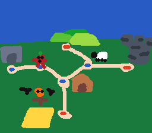

# Vision

## Startup and main menu

- Starts with distant view of celery city and logo and "Press (A)"  button
- File select screen appears after

 

- After file select, tomato is shown in rebel base showing all unlocks from that save file so far. Tomato turns away from the window at the start. Logo shouldn't be here, just options

## Maps and level select

- When start is selected, tomato turns around and leaves
- Game starts and tomato comes out of room in hub world
- Hubworld is rebel base in treehouse or something with multiple rooms and rescued rebels
- The base increases in size and population as more rebels are rescued

- World map can be accessed from hubworld where any available world can be selected
- World map changes with progress to include secret areas like hell and space

- Level select is like mario bro, each level should have distinct feature which is shown on the level select map so players can distinguish between levels when coming back

### Additional:
- Tomato only spawns in rebel base on game startup
- Start of each world is a rebel base and each world is unlocked by freeing a certain number of rebels to recapture the rebel base
- Travel between worlds is done through portals in rebel bases
- when a level is complete, tomato appears again on that level in level select screen
- Pressing "B" on level select goes back to world map
- Pressing "B" on world map does nothing
- Pressing "B" on treehouse rebel base does nothing

## Pause menus

- Pause menu should freeze the game in the background and add a gray translucent filter
- Pause menu in rebel bases, world map and level select contains "Settings", "Stats" and "Save and Quit"
- Pause menu in levels should include the above buttons and "Exit level"

## Base gameplay

- No run button
- Jump up should be faster than falling
- Speed cap for falling
- Shorter tap for shorter jump
- Slide slower when against a wall (hold away for ceratin amount of time to unstick)
- Wall jumping
- Coyote frames
- jump buffering
- slip when jumping under an edge (below)
- based on the hitboxes, tomato should not be able to jump higher than the bottom of the platform but slip would push tomato to the right when within a certain horizontal distance from the edge (shown in blue)

## Gameplay -upgrades

- Double jump
- Celeste dash (only horizontal with little up or down movement)
- Glide in air (messenger style)
- (Using dash + glide maintains dash momentum for a short while)
- Upgraded dash --when dashing through an object or enemy, gain another dash, but if dash button is held down, game freezes and select a direction (in orange), when released, tomato is launched in that direction (can be chained for cool platforming) (below)

- (Glide can also be used with this launch to maintain momentum for a while)
- Climb vertical surfaces like celeste
- Metroid shine spark
- No fall damage boots
- Sword final upgrade, can kill enemies now (air attacks don't change speed or) (similar to sword kirby)