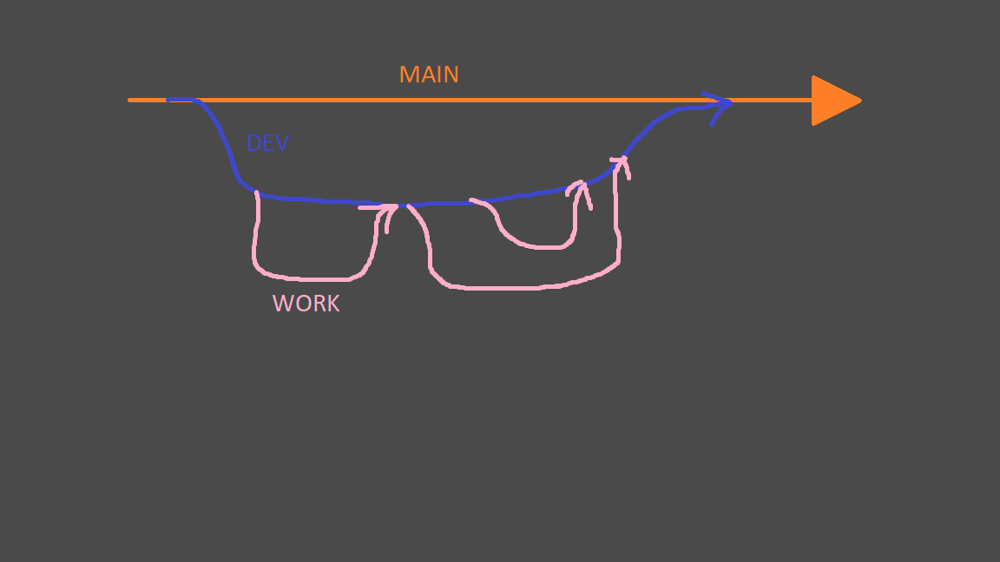

# BAME

## GIT RULES

- Every piece of work must be done on separate branch created from dev
- No one works on the same branch
- Once the piece of work is complete, everyone must be informed and a merge to dev will be done
- NEVER WORK ON MAIN BRANCH
- NEVER PULL FROM MAIN BRANCH

## GIT WORKFLOW

## GIT TRICKS
- Before creating a branch (from dev) always git pull
~~~
$ git pull
~~~

- change branches using git checkout, to create new branch use -b

~~~
$ git checkout (-b) <branch_name>
~~~

- Once changes are made to a branch, do the following steps to push it to the remote repository from your local repository

~~~
$ git add .

$ git commit -m "<type a message here>"

$ git push
~~~

- Now everyone can see the updated branch

- git status can be used to compare the status of your local repository against the remote repository

~~~
$ git status
~~~

# NEVER WORK ON MAIN BRANCH
